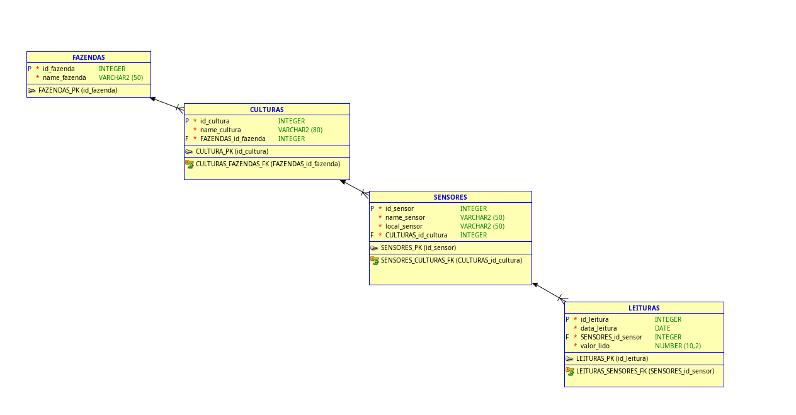

# FIAP - Faculdade de Informática e Administração Paulista

---

## FarmTech Solutions — Fase 4

### 👨‍🎓 Integrantes
- Ryan Carlos Sousa Alves da Cunha
- Vinícius Pereira Santana 
- Vitor Augusto Prado Guisso
  
### 👩‍🏫 Professores
- **Tutor:** Lucas Gomes Moreira
- **Coordenador:** Andre Godoi Chiovato

---

## 📜 MER — Modelo Entidade Relacionamento

Esta versão atualizada mostra como o sistema de irrigação agora armazena:
- Dados coletados dos sensores,
- Resultado da predição via Scikit-learn,
- Status da bomba física (via relé),
- Registro do monitoramento exibido no LCD e no Serial Plotter.

---

## 📦 CRUD Atualizado

### ✅ CREATE
- Insere um novo registro com os dados lidos no ESP32 + predição do ML:
  - Umidade
  - pH
  - Fósforo
  - Potássio
  - Status da bomba

### 🔍 READ
- Mostra todos os registros com status real e predito.

### 🔁 UPDATE
- Permite alterar umidade/pH manualmente, recalculando a predição.

### 🗑️ DELETE
- Permite excluir registros.

---

## 📌 Observações
- O Scikit-learn prevê se a bomba será ligada ou não com base no histórico.
- A lógica original de umidade também roda no ESP32.
- O banco de dados foi mantido no Oracle Cloud FIAP com o mesmo esquema.

---

