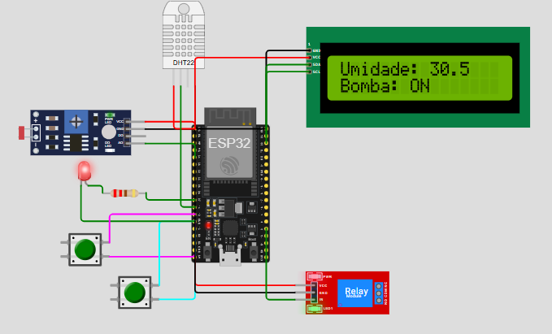
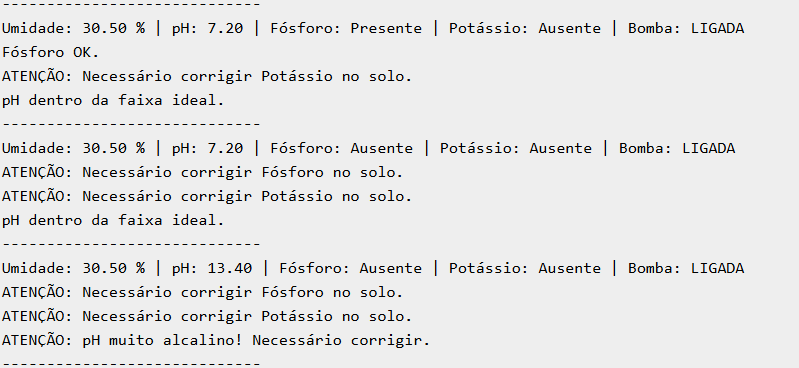
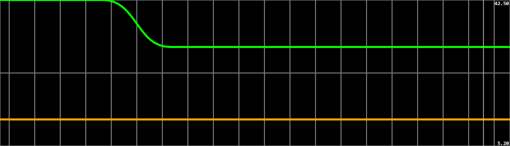

# FIAP - Faculdade de Informática e Administração Paulista

---

## FarmTech Solutions — Fase 4

### 👨‍🎓 Integrantes
- Vinícius Pereira Santana 
- Vitor Augusto Prado Guisso 

### 👩‍🏫 Professores
- **Tutor:** Lucas Gomes Moreira
- **Coordenador:** Andre Godoi Chiovato

---

## 📜 Introdução

  O objetivo deste projeto é simular um sistema de irrigação e monitoramento por sensores que medem a umidade do solo, pH, presença de fósforo e potássio. Com base nessas medições, o sistema decide automaticamente se deve acionar a bomba de água. Além disso, informa o usuário sobre a presença ou ausência dos nutrientes fósforo e potássio, e se o solo está ácido, ideal ou alcalino.
Além disso, os dados são integrados a um banco de dados Oracle, permitindo o gerenciamento completo via Python.

Na Fase 4 aprimoramos:
- **Circuito ESP32**: Adicionamos um relé real para controlar a bomba de irrigação.
- **Display LCD**: Informações críticas em tempo real (umidade, status da bomba).
- **Scikit-learn**: Modelo preditivo para antecipar a irrigação.
- **Dashboard Streamlit**: Visualização interativa.
- **Banco Oracle**: Mantido para registrar histórico.

---

## 📜 Circuito Wokwi

**Lógica de Funcionameto:** 
  A umidade é lida pelo DHT22. Caso o valor da umidade seja menor que 40%, então a bomba de irrigação (Led) é acionada automaticamente até que a umidade volte a ser maior ou igual a 40%.
O sensor de PH é simulado pelo LDH. O valor lido é convertido para a escala de pH entre 0 e 14. Foi considerado um pH ácido valores abaixo de 5,5 e pH alcalino valores acima de 7,5. 
Os Sensores de fósforo e potássio foram representados por botões. Caso o botão esteja pressionado então o nutriente é considerado presente. 
Vale ressaltar que para os dados de pH, presença/ausência de fósforo e potássio, o programa apenas avisa ao usuário o que está ocorrendo e sugere ações a serem tomadas.

**Componentes:**
- Microcontrolador ESP32
- Sensor DHT22: simula a umidade do solo
- Sensor LDR: simula o pH do solo por variação de luminosidade
- Botão 1: simula a presença/ausência de fósforo
- Botão 2: simula a presença/ausência de potássio
- Relé: simula a bomba de irrigação
- LED: indica o status da bomba (ligada/desligada)
- LCD I2C para exibir dados principais (umidade e status da bomba)

---
## 🔗 Link do Wokwi

Acesse o circuito simulado no Wokwi:  
[🌐 Wokwi Project](https://wokwi.com/projects/434291929867724801)

## 📜 Funcionamento

- Se a **umidade menor ou igual a 40%**, a bomba representada pelo relé é acionada até a umidade ficar maior que 40%.
- A predição do modelo complementa essa decisão.
- O display LCD mostra **Umidade (%)** e **Status da Bomba** diretamente no circuito.
- As demais informações (**pH, Fósforo, Potássio**) são exibidas no **Monitor Serial** com mensagens de orientação.
- O Serial Plotter mostra a curva de umidade em tempo real

---

## 🖥️ Monitor Serial

Abaixo, um exemplo da exibição das leituras no **Monitor Serial**, com mensagens de alerta para pH, fósforo e potássio:

---

## 📈 Serial Plotter

O **Serial Plotter** mostra a curva de variação da umidade em tempo real, ajudando a visualizar o acionamento da bomba:

## 📜 Código ESP32

- Código C++ otimizado para economizar memória.
- Relé acionado via GPIO.
- LCD atualizado a cada leitura.

---

## ⚙️ Código ESP32
> ⚠️ **Observação:** O código abaixo deve ser colado no IDE Arduino, compilado e enviado para o ESP32 no simulador Wokwi ou em hardware real. Certifique-se de ajustar os pinos se necessário.

#include <Wire.h>
#include <LiquidCrystal_I2C.h>
#include "DHT.h"

#define DHTPIN 14
#define DHTTYPE DHT22 
#define LDRPIN 34
#define FOSFORO_PIN 12
#define POTASSIO_PIN 13
#define LED_BOMBA 27  // LED indicador do estado da bomba
#define RELE_BOMBA 2  // Pino IN do módulo relé

LiquidCrystal_I2C lcd(0x27, 16, 2);
DHT dht(DHTPIN, DHTTYPE);

void setup() {
  Serial.begin(9600);
  dht.begin();
  Wire.begin(23, 22);
  lcd.init();
  lcd.backlight();

  pinMode(LDRPIN, INPUT);
  pinMode(FOSFORO_PIN, INPUT_PULLUP);
  pinMode(POTASSIO_PIN, INPUT_PULLUP);

  pinMode(LED_BOMBA, OUTPUT);
  digitalWrite(LED_BOMBA, LOW);

  pinMode(RELE_BOMBA, OUTPUT);
  digitalWrite(RELE_BOMBA, LOW);  // Relé começa desligado
}

void loop() {
  float umidade = dht.readHumidity();
  bool fosforoPresente = digitalRead(FOSFORO_PIN) == LOW;
  bool potassioPresente = digitalRead(POTASSIO_PIN) == LOW;
  int ldrValor = analogRead(LDRPIN);
  float ph = map(ldrValor, 0, 4095, 0, 140) / 10.0;
  ph = constrain(ph, 0.0, 14.0);

  bool bombaLigada = (umidade < 40.0);

  // Aciona o RELÉ (bomba real)
  digitalWrite(RELE_BOMBA, bombaLigada ? HIGH : LOW);

  // Aciona o LED indicador
  digitalWrite(LED_BOMBA, bombaLigada ? HIGH : LOW);

  // === DEBUG COMPLETO PARA MONITOR SERIAL ===
  Serial.print("Umidade: ");
  Serial.print(umidade);
  Serial.print(" % | pH: ");
  Serial.print(ph);
  Serial.print(" | Fósforo: ");
  Serial.print(fosforoPresente ? "Presente" : "Ausente");
  Serial.print(" | Potássio: ");
  Serial.print(potassioPresente ? "Presente" : "Ausente");
  Serial.print(" | Bomba: ");
  Serial.println(bombaLigada ? "LIGADA" : "DESLIGADA");

  if (!fosforoPresente) {
    Serial.println("ATENÇÃO: Necessário corrigir Fósforo no solo.");
  } else {
    Serial.println("Fósforo OK.");
  }

  if (!potassioPresente) {
    Serial.println("ATENÇÃO: Necessário corrigir Potássio no solo.");
  } else {
    Serial.println("Potássio OK.");
  }

  if (ph < 5.5) {
    Serial.println("ATENÇÃO: pH muito ácido! Necessário corrigir.");
  } else if (ph > 7.5) {
    Serial.println("ATENÇÃO: pH muito alcalino! Necessário corrigir.");
  } else {
    Serial.println("pH dentro da faixa ideal.");
  }

  Serial.println("-----------------------------");

  // === LCD ===
  lcd.clear();
  lcd.setCursor(0, 0);
  lcd.print("Umidade: ");
  lcd.print(umidade, 1);

  lcd.setCursor(0, 1);
  lcd.print("Bomba: ");
  lcd.print(bombaLigada ? "ON " : "OFF");

  // Delay ajustado para leitura mais lenta e clara
  delay(2000);
}

## 📜 Streamlit + Scikit-learn

> O dashboard está localizado na pasta `src/` como `app.py` e pode ser executado com `streamlit run app.py`. O modelo preditivo é salvo como pickle na mesma pasta.

- Dashboard com:
  - Tabela de registros
  - Gráfico de histórico de umidade
  - Previsão online de irrigação
- Pipeline salvo em pickle.

---

## 📜 Banco de Dados Oracle

O código Python conecta-se ao banco de dados Oracle e permite:
- Inserção de novos dados com base nas simulações do Wokwi
- Atualização individual de campos (pH, umidade, fósforo, potássio)
- Exclusão de registros
- Exibição completa do banco com formatação clara
- A bomba é calculada automaticamente com base na umidade inserida.
- Mesma tabela `sistema_irrigacao`
- Scripts `CREATE`, `INSERT`, `SELECT` dentro de `scripts/`

---

## 📜 Conclusão

  A Fase 4 integrou **hardware físico**, **Machine Learning**, **dashboard web** e **persistência de dados**, simulando um sistema de agricultura inteligente real.
  O projeto desenvolvido simulou com sucesso a aplicação prática de sensores e automação no contexto da irrigação agrícola, utilizando a plataforma Wokwi para simulação do circuito e o ESP32 como microcontrolador. A lógica implementada em C++ permitiu o monitoramento em tempo real da umidade do solo, valor de pH, e presença de nutrientes essenciais como fósforo e potássio, além do acionamento automático da bomba de irrigação.
A segunda parte do projeto envolveu a integração com Python e Oracle, onde os dados gerados foram armazenados, atualizados, consultados e manipulados de forma estruturada. Essa integração possibilitou a simulação de um sistema completo de gerenciamento agrícola inteligente, reunindo conceitos de eletrônica, programação embarcada, bancos de dados e análise de dados.
  Por fim, um modelo preditivo e interativo foi utilizado para a experiência do usuário. 

---
## 📹 Vídeo Demonstrativo

Assista ao vídeo de demonstração do projeto no YouTube:  
[▶️ Vídeo do Projeto](https://youtu.be/hbWBFAC73Io)

