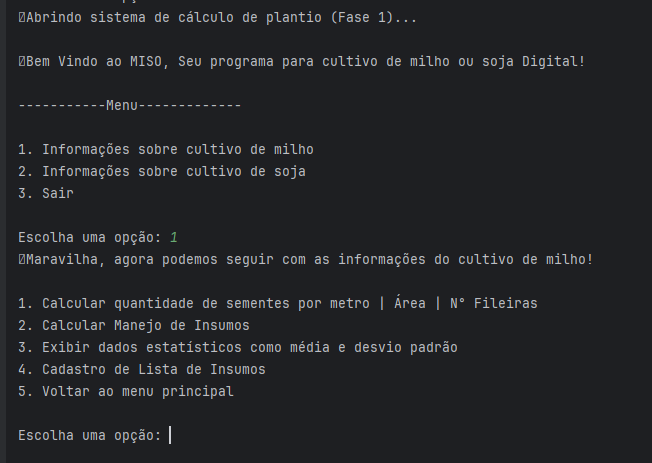
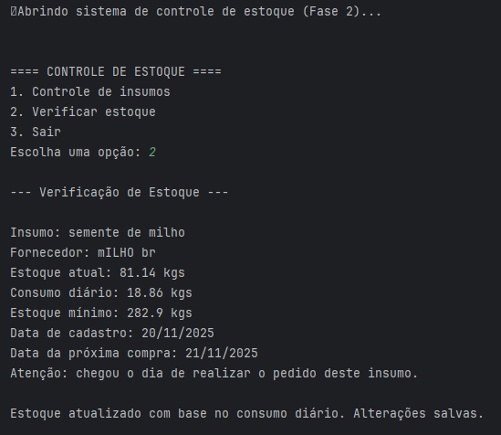
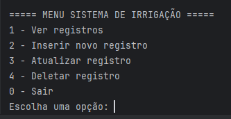
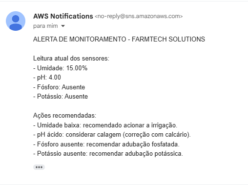
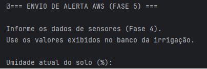
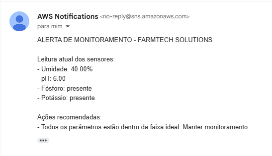
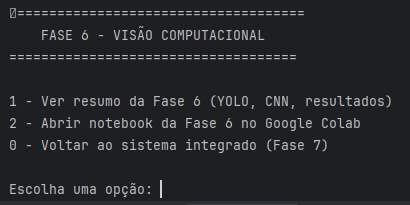
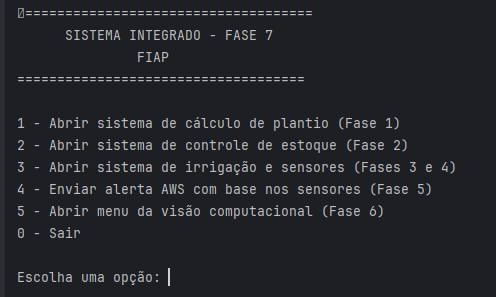

# FIAP - Faculdade de Informática e Administração Paulista

 

# FarmTech Solutions – Sistema Integrado de Monitoramento Agrícola (Fase 7)

## 👨‍🎓 Integrantes
- [Vinícius Pereira Santana]()
- [Vitor Augusto Prado Guisso]()

## 👩‍🏫 Professores
### Tutor(a)
- [Lucas Gomes Moreira](https://www.linkedin.com/company/inova-fusca)

### Coordenador(a)
- [Andre Godoi Chiovato](https://www.linkedin.com/company/inova-fusca)

---

## 📜 Descrição geral

Esta fase final reúne todo o trabalho das fases anteriores (1 a 6), consolidando em um **Sistema Integrado de Monitoramento Agrícola**.

O sistema unifica:

- 🌱 **Cálculo de plantio** (Fase 1)  
- 📦 **Controle de estoque (Lead Time)** (Fase 2)  
- 💧 **Sensores e controle de irrigação** (Fases 3 e 4)  
- 📬 **Alertas inteligentes via AWS SNS** (Fase 5)  
- 👁️ **Visão computacional com YOLOv8** (Fase 6)  

Tudo isso executado em um **único menu final**, totalmente funcional e integrado.

---

# 🧪 Atividades Desenvolvidas por Fase

---

# 🌱 Fase 1 — Sistema de Cálculo de Plantio

Funciona como uma calculadora agrícola completa, permitindo planejar corretamente o cultivo de milho ou soja.

  

## Funcionalidades

### Cálculo de:
- Área total de plantio  
- Número de fileiras  
- Plantas por metro  
- Espaçamento entre sementes  
- Sementes por fileira  
- Quantidade total de sementes  

### Cálculo de manejo de insumos:
- Fertilizantes  
- Inseticidas  

### Sistema interno de cadastro de insumos:
- Adicionar  
- Editar  
- Excluir  
- Exibir itens cadastrados  

---

# 🧮 Fase 2 — Sistema de Controle de Estoque

Sistema criado para administrar insumos agrícolas com base no consumo diário e no tempo de entrega.

  

## Funcionalidades
- Cadastro de insumos e fornecedor  
- Cálculo automático de:  
  - Estoque mínimo  
  - Data ideal para nova compra  
- Validação dos dados inseridos  

### Controle completo:
- Adicionar  
- Editar  
- Excluir  
- Listar insumos  

---

# 🚜 Fases 3 e 4 — Sistema de Sensores + Banco Oracle

Monitoramento agrícola via Banco Oracle, com sensores simulados e automação da irrigação.

  

## Sensores monitorados
- Umidade  
- pH  
- Fósforo  
- Potássio  

## Automação

O sistema realiza automaticamente diagnósticos e recomendações baseadas nos sensores:

### 🌧️ Umidade do Solo
- **umidade < 30% → acionar irrigação imediatamente**  
- **umidade > 80% → recomendar drenagem ou redução da irrigação**  
- Faixa ideal entre 30% e 80%

### ⚗️ pH do Solo
- **pH < 5.5 → recomendar calagem (correção com calcário)**  
- **pH > 7.5 → recomendar medidas para reduzir alcalinidade**

### 🧪 Fósforo
- **Fósforo ausente → recomendar adubação fosfatada**

### 🧪 Potássio
- **Potássio ausente → recomendar adubação potássica**

### 🟢 Condição Ideal
- Se nenhum parâmetro estiver fora da faixa:  
  **“Todos os parâmetros estão dentro da faixa ideal. Manter monitoramento.”**

### 💾 Registro
- Todas as leituras são **gravadas automaticamente** no Banco Oracle FIAP.
- As recomendações geradas abastecem o módulo de **alertas automáticos via AWS SNS**.

## Sistema completo para:
- Inserir novos registros  
- Atualizar registros  
- Deletar registros  
- Visualizar histórico  

### Exemplo de alerta recomendado

  

---

# 📡 Fase 5 — Envio de Alertas com AWS SNS

O sistema envia e-mails automáticos contendo dados dos sensores e recomendações agrícolas.

  

## Conteúdo dos alertas
- Umidade  
- pH  
- Fósforo  
- Potássio  

### Recomendações incluídas:
- Acionar irrigação  
- Fazer calagem  
- Realizar adubação fosfatada  
- Realizar adubação potássica  

## Tecnologias
- boto3 (AWS SNS)  
- Variáveis de ambiente para segurança  
- Funcionamento automático (com sensores – Fase 4)  
- Funcionamento manual (menu da Fase 5)  

### Exemplo real de e-mail

  

---

# 👁️ Fase 6 — Visão Computacional (YOLO + CNN)

Treinamento de modelos de IA para detectar bovinos e funcionários nas imagens da fazenda.

  

## Conteúdo da fase
- Dataset com **80 imagens rotuladas**  
- Treinamento YOLOv8 (30 e 60 épocas)  
- Comparação com YOLO COCO e CNN do zero  
- Relatórios, gráficos e métricas  
- Inferências e análises técnicas  
- Possibilidade de testar novas imagens via Colab  

---

# 🧩 Fase 7 — Sistema Integrado (Dashboard Final)

Integração completa de **TODAS as fases anteriores** em um único menu principal.

  

## Menu Final

1 - Abrir sistema de cálculo de plantio (Fase 1)  
2 - Abrir sistema de controle de estoque (Fase 2)  
3 - Abrir sistema de irrigação e sensores (Fases 3 e 4)  
4 - Enviar alerta AWS com base nos sensores (Fase 5)  
5 - Abrir menu da visão computacional (Fase 6)  
0 - Sair

Permite navegar por todos os módulos sem mudar de arquivo.

### 📌 Arquivo principal
[➡️ Abrir dashboard.py](src/fase7_sistema_integrado/dashboard.py)

---

# 🔗 Links importantes

📓 Notebook visão computacional (Fase 6):  
https://github.com/vitorguisso/fork_fase4/blob/master/Fase%206/src/VitorGuisso_rm562317_fase6.ipynb

📁 Arquivos YOLO & Dataset (Google Drive):  
https://drive.google.com/drive/folders/1SmJSAe45lyQtrxiUbv5JriFim3BAgRya

🎥 Vídeo final – Fase 7:  
[Vídeo Demonstração Fase 7](https://www.youtube.com/watch?v=2mTAzm6e73U)

---

# 🔧 Como executar o projeto

## 1. Clonar o repositório

git clone https://github.com/vitorguisso/fork_fase4.git  
cd "fork_fase4/Fase 7"

## 2. Criar ambiente virtual

python -m venv .venv  
.venv\Scripts\activate     # Windows  
source .venv/bin/activate  # Linux / Mac

## 3. Instalar dependências

pip install cx_Oracle boto3 pandas numpy scikit-learn matplotlib streamlit opencv-python ultralytics

---

# 🔌 Conexão com o Banco Oracle FIAP

Exemplo usado no código:

username = "RM562317"  
password = "100598"  
dsn = "oracle.fiap.com.br/orcl"

Para outro usuário FIAP acessar:

username = "SEU_USUARIO"   # Ex: RM123456  
password = "SUA_SENHA"  
dsn = "oracle.fiap.com.br/orcl"

⚠️ Importante:  
O sistema está configurado para o RM562317.  
Para executar, substitua pelas credenciais do seu RM.

---

# ☁️ Configuração da AWS (Alertas por SNS)

Variáveis de ambiente (Windows):

AWS_KEY=SUACHAVE  
AWS_SECRET=SUASECRET  

Atualizar ARN no arquivo:  
src/fase5_analise_aws/aws_alertas.py

TOPIC_ARN = "arn:aws:sns:sa-east-1:XXXXXXXXXXXX:farmtech-alertas"

---

# ▶️ Executar o sistema integrado

[➡️ Abrir dashboard.py](src/fase7_sistema_integrado/dashboard.py)

---

# 📊 Conclusões e resultados

- Sistema completamente integrado  
- Todos os módulos funcionando em conjunto  
- Banco Oracle com dados reais  
- Alertas AWS com recomendações agronômicas  
- YOLOv8 treinado demonstrando visão computacional aplicada  
- Projeto fiel ao PBL e totalmente operacional  

---

# 🔥 Destaques

- Integração IA + IoT + Banco + AWS  
- Arquitetura modular e escalável  
- Solução realista para agronegócio  

---

# 📁 Estrutura de pastas

Fase 7/  
 ├── assets/  
 ├── document/  
 ├── scripts/  
 ├── src/  
 │   ├── fase1_calculo_plantio/  
 │   ├── fase2_banco_relacional/  
 │   ├── fase4_sistema_irrigacao_dashboard/  
 │   ├── fase5_analise_aws/  
 │   ├── fase6_visao_computacional/  
 │   ├── fase7_sistema_integrado/  
 ├── README.md  

---

# 🗃 Histórico de Lançamentos

1.0.0 – 21/11/2025  
Entrega final da Fase 7 — Sistema Integrado completo.

---

## 📋 Licença

<a property="dct:title" rel="cc:attributionURL" href="https://github.com/agodoi/template">MODELO GIT FIAP</a> por <a rel="cc:attributionURL dct:creator" property="cc:attributionName" href="https://fiap.com.br">Fiap</a> está licenciado sobre <a href="http://creativecommons.org/licenses/by/4.0/?ref=chooser-v1" target="_blank" rel="license noopener noreferrer" style="display:inline-block;">Attribution 4.0 International</a>.

